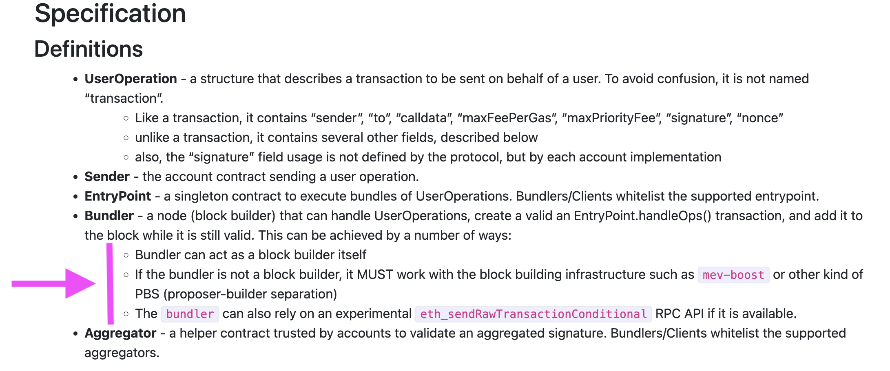
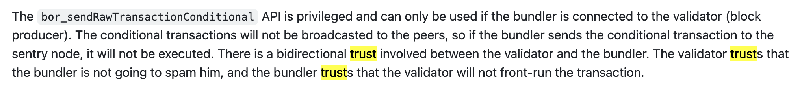
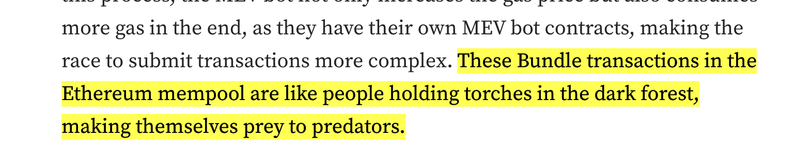

## Notes

- 4 main block builders
- https://mevboost.pics/

#### Context 
- More and more chains are adding support for AA (Ethereum, BSC, Solana, Avax, Polygon, Algorand, Fantom, Gnosis, Tezos, Iotex, Harmony, Fuse, Optimism, Arbitrum, Celo, Near, Cosmos, Aurora, Polkadot, Flow), as well as many [RPC Providers](https://github.com/arddluma/awesome-list-rpc-nodes-providers#account-abstraction-rpc-providers).
- Filecoin launched an EVM this past March 2023 and the community is interested in adding support for AA.
  - However Filecoin's blockchain has a different structure from Ethereum's and does not have an MEV economy or tools like MEV-boost.
  - We are also worried about the possible attack vectors of AA because there are lots of trust assumptions between bundlers and block builders

#### What about Malicious Miners?

- There are places in the AA spec where submitting Txns to a malicious miner can cause trouble.
- These issues also exist on Eth where Txns are supposed to be submitted to "block builders you trust"...
- *What if there are malicious miners who attack bundlers?*
   - 4337 addresses this by saying that bundlers can only submit bundles to block producers they trust:
   

 - `eth_sendRawTransactionConditional` - Polygon and Arbitum have implemented this API method
 - But from Polygon's https://github.com/maticnetwork/Polygon-Improvement-Proposals/blob/main/PIPs/PIP-15.md:
 
 

- From the PIP excerpt above: "The validator trusts that the bundler is not going to spam him, and the bundler trusts that the validator will not front-run the transaction."

#### Centralized AA Infra & Private Mempools

- Trust is straightforward when your AA infra provider is private but this is centralized
    - Users must select a specific private bundler to trust
    - AA infra provider must also be a block builder or work with block builders they trust.
- A public p2p mempool is coming to Ethereum

#### A Public Mempool is coming to Eth

The article [Why Must ERC-4337 Bundlers Work with Block Builders](https://medium.com/@blockpi/aa-useroperation-failure-incident-why-is-public-mempool-necessary-to-erc-4337-bundlers-d939d6dc8812) talks about nonce collision attacks in bundlers:

- *To summarize the article:*

    - After the public mempool is introduced, most UserOps are from this pool.
    - There must be a mechanism to prevent multiple Bundlers from bundling the same UserOperation in the mempool.
    - EtherSpot is developing this p2p network where once bundled and processed on-chain, UserOps will be marked and delisted. They say: "it is meaningless to send duplicate UserOps to the mempool because it can be easily detected by the p2p network."
    - At this point, multiple Bundlers will access the same set of unprocessed UserOps.
    - They recommend that **"One cannot and should not run a bundler in the p2p mempool without a service like mevboost on a public mempool on Ethereum."**
    - This will ensure the elimination of duplicate submissions and reduce online rejections.

There seem to be additional hidden assumptions in how the mevboost block builder market work with bundlers.

- Filecoin doesn’t have an mevboost block builder market 
    - Do all of these chains have this?...
        - More and more chains (Eth, BSC, Solana, Avax, Polygon, Algorand, Fantom, Gnosis, Tezos, Iotex, Harmony, Fuse, Optimism, Arbitrum, Celo, Near, Cosmos, Aurora, Polkadot, Flow) are adding support for AA
